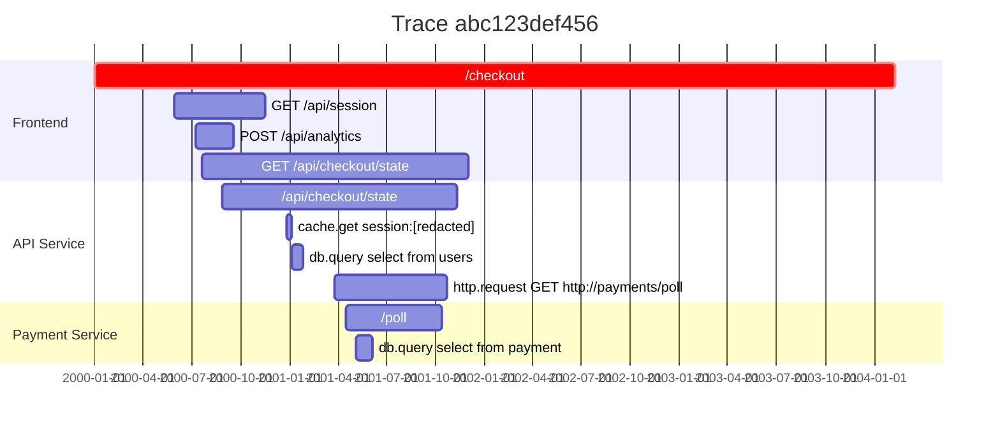

# trace2mermaid

Convert [OpenTelemetry](https://opentelemetry.io/) OTLP JSON traces into
[Mermaid](https://mermaid.js.org/) Gantt diagrams. Produces a proportional
timeline view of spans grouped by service, similar to Jaeger's trace view.

## Installation

### Homebrew

```sh
brew install mheap/tap/trace2mermaid
```

### Go

```sh
go install github.com/mheap/trace2mermaid@latest
```

### Docker

```sh
cat trace.jsonl | docker run -i mheap/trace2mermaid
```

### Binary releases

Download a prebuilt binary from the
[releases page](https://github.com/mheap/trace2mermaid/releases).

## Usage

```
Usage: trace2mermaid [options] [file]

Convert OpenTelemetry trace JSONL to a Mermaid Gantt diagram.

Arguments:
  file        Path to OTLP JSON Lines trace file (reads stdin if omitted)

Options:
  -f, --format <format>  Output format: mermaid (default), svg
  -h, --help             Show this help message
  -v, --version          Show version information
```

### Examples

Read from a file:

```sh
trace2mermaid trace.jsonl
```

Read from stdin:

```sh
cat trace.jsonl | trace2mermaid
```

Render directly to SVG:

```sh
trace2mermaid --format svg trace.jsonl > trace.svg
```

### Output formats

| Format | Description |
|--------|-------------|
| `mermaid` | Mermaid Gantt diagram text (default). Paste into any Mermaid renderer. |
| `svg` | Self-contained SVG image with millisecond axis labels. Opens in any browser. |

## Input format

The input is one or more JSON lines in
[OTLP JSON](https://opentelemetry.io/docs/specs/otlp/#json-protobuf-encoding)
format. Each line is a `TracesData` object containing `resourceSpans`:

```jsonl
{"resourceSpans":[{"resource":{"attributes":[{"key":"service.name","value":{"stringValue":"api"}}]},"scopeSpans":[{"spans":[{"traceId":"abc123","spanId":"0001","parentSpanId":"","name":"GET /users","startTimeUnixNano":"1000000000000000","endTimeUnixNano":"1000000500000000","status":{}}]}]}]}
```

Most OpenTelemetry exporters can produce this format. For example, with the
OTEL Collector's
[file exporter](https://github.com/open-telemetry/opentelemetry-collector-contrib/tree/main/exporter/fileexporter):

```yaml
exporters:
  file:
    path: /tmp/traces.jsonl
```

## Example output

Given a trace with three services (Frontend, API Service, Payment Service),
`trace2mermaid` produces:



Root spans are highlighted in red (`crit`). Spans with error status are
shown in grey (`done`). The x-axis shows millisecond offsets from the
trace start (1 day in the Mermaid diagram = 1 ms of trace time).

## Development

### Prerequisites

- Go 1.24+

### Build

```sh
go build .
```

### Test

Tests use golden files. Run them with:

```sh
go test -v ./internal/trace/
```

To update golden files after intentional output changes:

```sh
go test -v ./internal/trace/ -args -update
```

### Lint

```sh
golangci-lint run ./...
```
